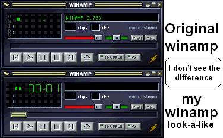



## Skinned working fake Winamp

### Description

This program is an imitation of Nullsoft's Winamp. It's is skinnable with the Winamp skins, can play music and sound (mp3, wav, cda, etc...) and works completely.
 
### More Info
 

             |
---                |---
**Submitted On**   |2002-05-03 22:36:18
**By**             |[VirtLink Software Productions](https://github.com/Planet-Source-Code/PSCIndex/blob/master/ByAuthor/virtlink-software-productions.md)
**Level**          |Advanced
**User Rating**    |2.7 (19 globes from 7 users)
**Compatibility**  |VB 5\.0, VB 6\.0
**Category**       |[Sound/MP3](https://github.com/Planet-Source-Code/PSCIndex/blob/master/ByCategory/sound-mp3__1-45.md)
**World**          |[Visual Basic](https://github.com/Planet-Source-Code/PSCIndex/blob/master/ByWorld/visual-basic.md)
**Archive File**   |[Skinned\_wo79163542002\.zip](https://github.com/Planet-Source-Code/virtlink-software-productions-skinned-working-fake-winamp__1-34436/archive/master.zip)

